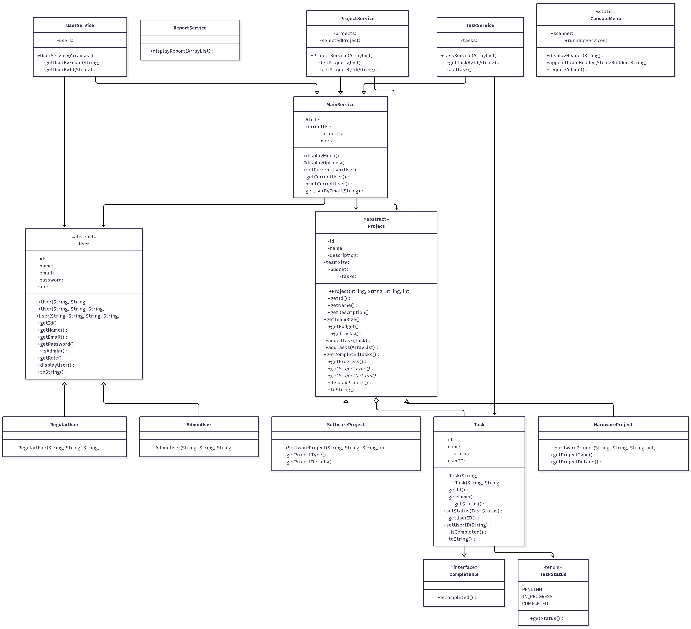

# Project Manager System (PMS)

A comprehensive Java-based project management system for managing projects, tasks, users, and generating status reports.



## Features

### Feature 1: Project Catalog Management

> - Create new projects (Software or Hardware)
> - View all existing projects with details (ID, name, description, team size, budget)
> - Filter projects by type
> - Display project-specific attributes dynamically

### Feature 2: Task Operations

> - Add tasks to specific projects
> - Assign task status (Pending, In Progress, Completed)
> - View all tasks per project with progress details
> - Update or delete tasks
> - Input validation to prevent invalid task status or duplicate task names

### Feature 3: User Management

> - Create and manage users (RegularUser and AdminUser)
> - Assign users to projects
> - Enforce role-based access control
> - Admin: can delete/update projects and tasks
> - Regular User: can view and add tasks
> - Automatically generate unique user IDs

### Feature 4: Status Processing & Reporting

> - Calculate and display completion percentages per project
> - Generate status reports with project progress summaries
> - Display task statistics (total, completed, pending counts)
> - Show per-user performance summaries

### Feature 5: Menu Navigation & User Experience

> - Interactive main menu and sub-menus for all operations
> - Input validation for numbers, text, and IDs
> - Formatted outputs with clear sections and alignment
> - Graceful navigation with back/exit options

## Prerequisites

> - \*\*Java Development Kit (JDK) 21 or higher
> - **Terminal/Command Prompt** for running commands

## Setup

### 1. Clone or navigate to the project directory

```bash
gh repo clone kratosgado/pms or git clone https://github.com/kratosgado/pms.git
cd pms
```

### 2. Compile the project

```bash
javac -d bin src/**/*.java src/*.java
```

This command compiles all Java source files and outputs `.class` files to the `bin` directory.

### 3. Run the application

```bash
java -cp bin Main
```

The application will start with an authentication menu.

## Usage

### Starting the Application

1. Run the application using the command above
2. You will be prompted to authenticate with an email and password
3. There are default users with the following credentials:
   > - <kratos@gmail.com>/password (Admin)
   > - <mbeah@gmail.com>/password (Regular)
   > - <prince@gmail.com>/password (Regular)
   > - <gado@gmail.com>/password (Regular)

### Main Menu Options

After authentication, you can:

1. **Project Management** > - Create, view, delete, and filter projects
2. **Task Management** > - Add, update, or delete tasks for projects
3. **User Management** > - Create, view, delete users
4. **Status Reports** > - View project progress and task statistics
5. **Exit** > - Gracefully exit the application

### User Roles

#### Admin User

> - Full project and task management capabilities
> - Can delete and update projects/tasks
> - Can manage other users

#### Regular User

> - Can view projects and tasks
> - Limited update/delete permissions

### Example Workflow

1. **Create a Project:**

   > - Select "Project Management" from menu
   > - Choose "Add Project"
   > - Select project type (Software or Hardware)
   > - Enter project details (name, description, team size, budget)

2. **Add a Task:**

   > - Select "Task Management"
   > - Select the project
   > - Choose "Add Task"
   > - Enter task name and initial status (name, status)

3. **Update Task Status:**

   > - Select "Task Management"
   > - Choose "Update Task"
   > - Update status to "In Progress" or "Completed"

4. **View Reports:**
   > - Select "Status Reports"
   > - View project completion percentage
   > - See task statistics and project summaries

## Project Structure

```
pms/
├── src/
│   ├── Main.java                 # Application entry point
│   ├── models/                   # Data models
│   │   ├── Project.java
│   │   ├── SoftwareProject.java
│   │   ├── HardwareProject.java
│   │   ├── Task.java
│   │   ├── User.java
│   │   ├── AdminUser.java
│   │   ├── RegularUser.java
│   │   └── StatusReport.java
│   ├── services/                 # Business logic
│   │   ├── MainService.java
│   │   ├── ProjectService.java
│   │   ├── TaskService.java
│   │   ├── UserService.java
│   │   └── ReportService.java
│   ├── utils/                    # Utilities
│   │   ├── ConsoleMenu.java
│   │   ├── Console.java
│   │   ├── ValidationUtils.java
│   │   ├── CustomUtils.java
│   │   ├── TaskStatus.java
│   │   └── Seed.java
│   └── interfaces/               # Interfaces
├── bin/                          # Compiled class files
├── docs/                         # Documentation
└── README.md                     # This file
```

## Input Validation

The system validates all user inputs:

> - Numeric values are checked for valid ranges
> - Email addresses are verified for proper format
> - Project and task names are checked for duplicates
> - Task status values are validated against allowed statuses

## Tips

> - Use the back option in menus to return to the previous screen
> - All user IDs are automatically generated for convenience
> - Project budgets support decimal values for precision
> - Task status transitions follow a logical workflow: Pending → In Progress → Completed

## Troubleshooting

**Compilation errors:**

> - Ensure all Java files are in the correct directory structure
> - Verify JDK version is 21 or higher

**Runtime errors:**

> - Check that all class files were compiled to the `bin` directory
> - Ensure proper input format when prompted

## Notes

> - The system uses an in-memory data structure (may be enhanced with database integration in future versions)
> - User performance summaries are flagged for future expansion
> - The system supports graceful error handling with user-friendly error messages
